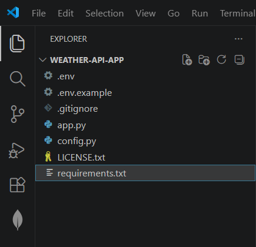
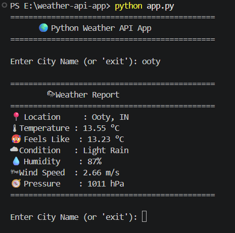
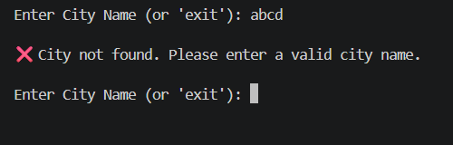

# 🌦 Python Weather API App

A simple and beginner-friendly Python command-line application that fetches real-time weather information using the OpenWeather API.

---

## 🚀 Features

- 🌍 Search weather by city name
- 🌡 Current temperature
- 🥵 Feels like temperature
- ☁ Weather condition
- 💧 Humidity
- 🌬 Wind speed
- 🧭 Atmospheric pressure
- ❌ Handles invalid city names
- 🔒 Secure API key using `.env`

---

## 🛠 Tech Stack

- Python 3
- OpenWeather API
- Requests
- Python Dotenv

---

## 📂 Project Structure

```text
Python-Weather-API-App/
│
├── app.py
├── config.py
├── .env
├── .env.example
├── .gitignore
├── requirements.txt
├── README.md
├── LICENSE
│
└── screenshots/
    ├── project-structure.png
    ├── weather-output.png
    └── invalid-city.png
```

---

## ⚙ Installation

Clone the repository

```bash
git clone https://github.com/siranjithr/Python-Weather-API-App.git
```

Move into the project

```bash
cd Python-Weather-API-App
```

Install dependencies

```bash
pip install -r requirements.txt
```

Create a `.env` file

```env
OPENWEATHER_API_KEY=YOUR_API_KEY
```

Run the project

```bash
python app.py
```

---

## 📸 Screenshots

### 📁 Project Structure



### 🌦 Weather Output



### ❌ Invalid City



---

## 📚 Skills Learned

- Python Fundamentals
- API Integration
- JSON Parsing
- Environment Variables (.env)
- Exception Handling
- Modular Programming
- Command-Line Application Development

---

## 🔮 Future Improvements

- 5-Day Weather Forecast
- Air Quality Index (AQI)
- Weather Icons
- Save Search History
- GUI Version using Tkinter
- Web Version using Flask

---

## 👨‍💻 Author

**S. Ranjith**

GitHub: https://github.com/siranjithr

LinkedIn: *(Add your LinkedIn profile URL here)*

---

## 📄 License

This project is licensed under the MIT License.
